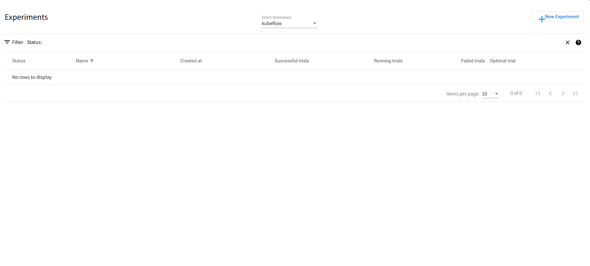
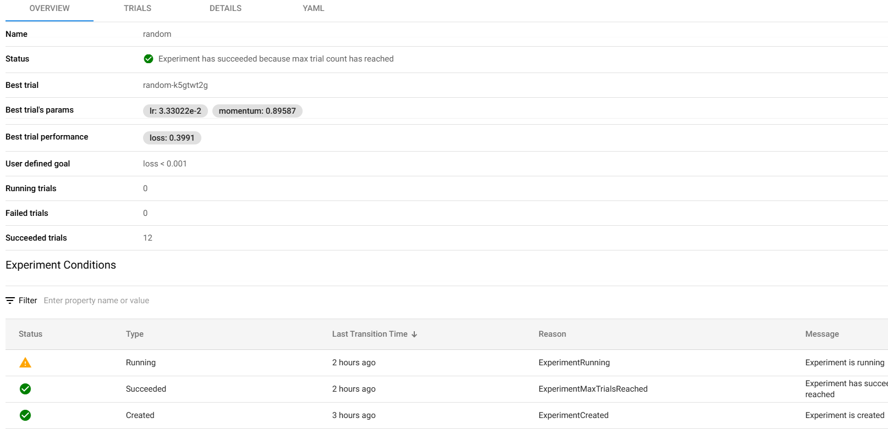
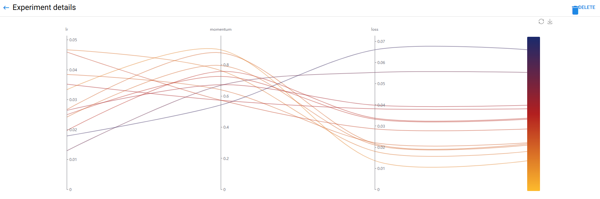

# Katib部署指南

## ‌一、环境准备


### 更新系统


#### EulerOS2.0


```
yum -y update  
yum -y upgrade
```


#### Ubuntu 24.04


```
apt-get -y update
export DEBIAN_FRONTEND=noninteractive
apt-get -y -o Dpkg::Options::="--force-confold" dist-upgrade
```


## 二、安装docker


#### EulerOS2.0


参考：[安装Docker](https://support.huaweicloud.com/bestpractice-hce/hce_bp_0002.html)

#### Ubuntu 24.04


参考：[安装Docker](https://www.runoob.com/docker/ubuntu-docker-install.html)

## **三、安装conda**


```
mkdir -p ~/miniconda3

wget https://repo.anaconda.com/miniconda/Miniconda3-latest-Linux-aarch64.sh -O ~/miniconda3/miniconda.sh

bash ~/miniconda3/miniconda.sh -b -u -p ~/miniconda3

rm -f ~/miniconda3/miniconda.sh

source ~/miniconda3/bin/activate

conda init --all
```


创建虚拟环境

```
conda create -n katib python=3.9
```


## **四、源码下载**

### **1.下载源码**

```
git clone https://github.com/kubeflow/katib.git

pip install -U kubeflow-katib -i https://pypi.tuna.tsinghua.edu.cn/simple

sudo yum install -y conntrack-tools

步骤一：下载包

wget https://github.com/kubernetes-sigs/cri-tools/releases/download/v1.25.0/crictl-v1.25.0-linux-arm64.tar.gz

tar -zxvf crictl-v1.25.0-linux-arm64.tar.gz

sudo mv crictl /usr/local/bin/

crictl --version

wget https://github.com/Mirantis/cri-dockerd/releases/download/v0.3.15/cri-dockerd-0.3.15.arm64.tgz

tar -zxvf cri-dockerd-0.3.15.arm64.tgz

sudo mv cri-dockerd/cri-dockerd /usr/local/bin/

cri-dockerd --version

wget https://github.com/containernetworking/plugins/releases/download/v1.5.1/cni-plugins-linux-arm64-v1.5.1.tgz

sudo mkdir -p /opt/cni/bin

tar -zxvf cni-plugins-linux-arm64-v1.5.1.tgz -C /opt/cni/bin

配置 cri-docker systemd 服务

sudo wget https://raw.githubusercontent.com/Mirantis/cri-dockerd/master/packaging/systemd/cri-docker.service -O /etc/systemd/system/cri-docker.service

sudo wget https://raw.githubusercontent.com/Mirantis/cri-dockerd/master/packaging/systemd/cri-docker.socket -O /etc/systemd/system/cri-docker.socket

启用并启动服务

sudo systemctl daemon-reload

sudo systemctl enable cri-docker.service

sudo systemctl enable --now cri-docker.socket

sudo systemctl start cri-docker.service

sudo mkdir -p /etc/cni/net.d
```

 

## 五、启动项目

### 1.启动脚本编辑

[katib.sh](../scripts/katib.sh)

### 2.运行启动

```
conda activate katib

cd /home/katib

bash katib.sh
```

使用http://ip+8080/katib就能打开网页




之后就能够在对应的空间下创建实验

 

实验进行需要一些时间，之后就能获得训练日志和训练结果。

 

 
